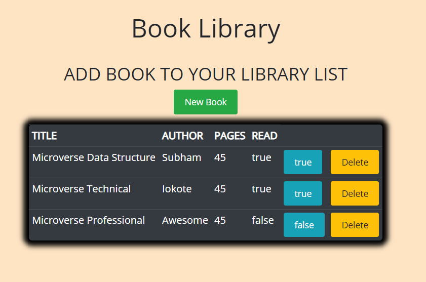

# BOOK LIBRARY ON JS

[![Contributors][contributors-shield]][contributors-url]
[![Forks][forks-shield]][forks-url]
[![Stargazers][stars-shield]][stars-url]
[![Issues][issues-shield]][issues-url]

We are creating a small Book Library App with help of JS. In this section we are working in understanding of  Objects and the Object Constructor. This web app allows the user to add and remove books, and also toggle between read and unread status for added books.

### Predefined Library



### Adding Books to the Library


## Built With

- HTML + CSS
- JavaScript
- Bootstrap

## Getting Started

To get started with the app, cd to the directory where you would like the repo to live by typing on your terminal:

Clone the repo typing:

```
$ git clone https://github.com/shubham14p3/library.git
```

##  Features / Usage
- Three books added by default for the demo.
- Click "Add new" to add a new book using the provided form.
- We do have validation for Author name and Pages Entered.
- After including the required data, hit "Save". You will see the notice message flashing.
- The book is displayed. If the page is reloaded previously added data is removed since there is no DB or local storage set up.


## Authors

👤 **Cyrus Kiprop**

- Github: [Cyrus-Kiprop](https://github.com/Cyrus-Kiprop)
- Twitter: [@kipropJS](https://twitter.com/kipropJS)
- Linkedin: [Cyrus Kiprop](https://www.linkedin.com/in/cyrus-kiprop-ba7320120/)


👤 **Shubham Raj**

- Github: [@ShubhamRaj](https://github.com/shubham14p3)
- Linkedin: [Shubham14p3](https://www.linkedin.com/in/shubham14p3/)

## 🤝 Contributing

Contributions, issues and feature requests are welcome!

Feel free to check the [issues page](https://github.com/shubham14p3//library/issues/).

## Show your support

Give a ⭐️ if you like this project!

## Acknowledgments

- Project requested by [Microverse Program](https://www.microverse.org/).

<!-- MARKDOWN LINKS & IMAGES -->

[contributors-shield]: https://img.shields.io/github/contributors/shubham14p3/members-only.svg?style=flat-square
[contributors-url]: https://github.com/shubham14p3/library/graphs/contributors
[forks-shield]: https://img.shields.io/github/forks/shubham14p3/members-only.svg?style=flat-square
[forks-url]: https://github.com/shubham14p3/library/network/members
[stars-shield]: https://img.shields.io/github/stars/shubham14p3/members-only.svg?style=flat-square
[stars-url]: https://github.com/shubham14p3/library/stargazers
[issues-shield]: https://img.shields.io/github/issues/shubham14p3/members-only.svg?style=flat-square
[issues-url]: https://github.com/shubham14p3/library/issues
